# 🚦 AI Service — Smart Pothole Detection and Reporting System

> [!NOTE]
> A dedicated **FastAPI-based AI microservice** responsible for detecting potholes in images and videos using a pretrained **YOLOv8** object detection model.
> The AI service is intentionally separated from the main backend so that computer-vision inference remains an independent, scalable service. The backend communicates with this service through HTTP APIs.

## 📑 Table of Contents

- [1. Overview](#1-overview)
- [2. Role of the AI Service](#2-role-of-the-ai-service)
- [3. Architecture](#3-architecture)
- [4. Technology Stack](#4-technology-stack)
- [5. Why YOLOv8](#5-why-yolov8)
- [6. Model Selection](#6-model-selection)
- [7. Why We Did Not Train the Model](#7-why-we-did-not-train-the-model)
- [8. AI Service Development Steps](#8-ai-service-development-steps)
- [9. Project Structure](#9-project-structure)
- [10. Configuration](#10-configuration)
- [11. YOLO Model Manager](#11-yolo-model-manager)
- [12. Image Inference Pipeline](#12-image-inference-pipeline)
- [13. Image API](#13-image-api)
- [14. Video Processing Pipeline](#14-video-processing-pipeline)
- [15. Video API](#15-video-api)
- [16. Response Handling](#16-response-handling)
- [17. Error Handling](#17-error-handling)
- [18. API Endpoints](#18-api-endpoints)
- [19. Testing](#19-testing)
- [20. Dockerization](#20-dockerization)
- [21. Complete Request Flow](#21-complete-request-flow)
- [22. Important Design Decisions](#22-important-design-decisions)
- [23. Current Limitations](#23-current-limitations)
- [24. Future Improvements](#24-future-improvements)
- [25. Running Locally](#25-running-locally)
- [26. Running with Docker](#26-running-with-docker)
- [27. Integration with Main Backend](#27-integration-with-main-backend)

---

## 1. Overview

The Smart Pothole Detection and Reporting System contains a dedicated AI service for computer-vision processing.

**The responsibility of this service is simple:**
`Receive an image or video` ➔ `Run pothole detection` ➔ `Format detection results` ➔ `Return structured JSON`

> [!WARNING]
> **Out of Scope for this Service:**
> - User authentication
> - Database operations
> - Reports
> - Payments
> - User management
> - Business logic of the main application
> - Frontend rendering
> 
> Those responsibilities belong to the main backend/frontend system. The AI service focuses **only** on computer-vision inference.

---

## 2. Role of the AI Service

The AI service acts as an independent AI microservice between the main backend and the YOLO model.

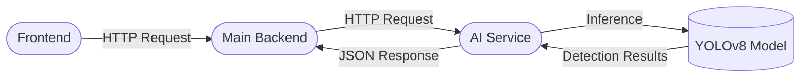

This separation provides a clean architecture where AI processing can evolve independently from the application backend.

---

## 3. Architecture

### High-Level Architecture

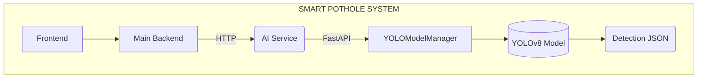

### Internal AI Service Architecture

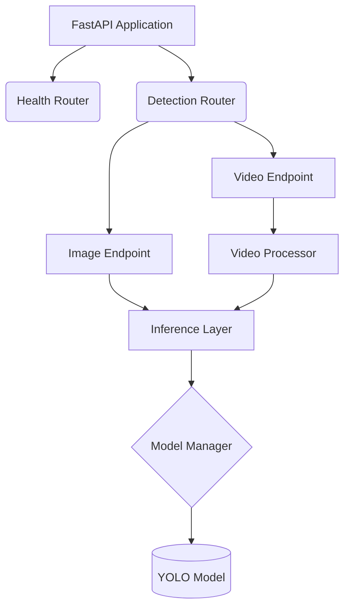

---

## 4. Technology Stack

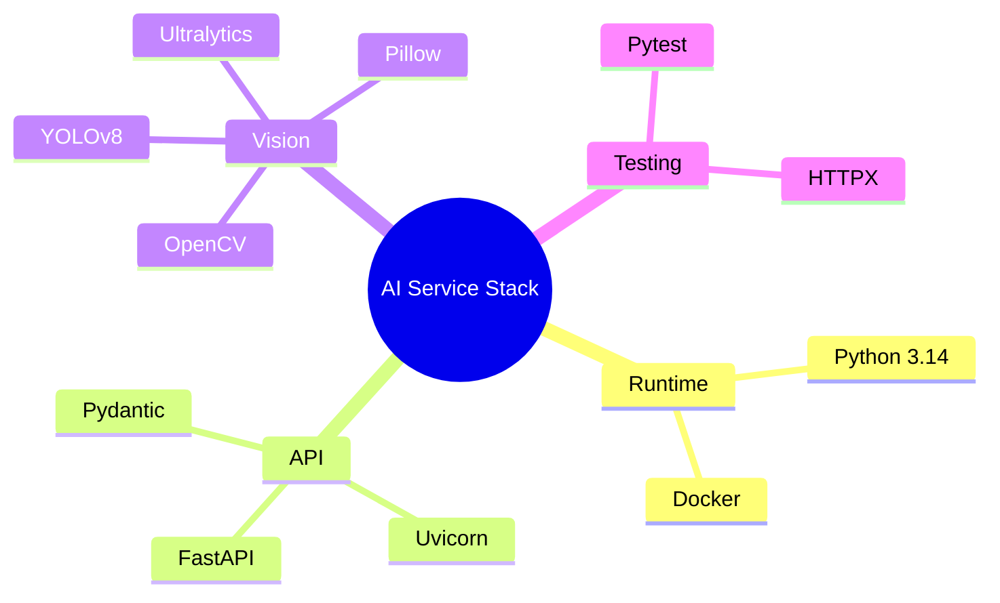

| Technology | Purpose |
|------------|---------|
| **Python 3.14** | AI service runtime |
| **FastAPI** | REST API framework |
| **Uvicorn** | ASGI server |
| **Ultralytics** | YOLO model framework |
| **YOLOv8** | Object detection |
| **OpenCV** | Video/frame processing |
| **Pillow** | Image decoding and conversion |
| **Pydantic** | Response validation & Settings |
| **Pytest** | Automated testing |
| **Docker** | Containerization |

---

## 5. Why YOLOv8

YOLO was selected because pothole detection is an **object detection** problem.

We don't only need to know: *"Is there a pothole?"*
We also need to know: *"Where is the pothole in the image?"*

Object detection provides both **Class Confidence** and **Bounding Boxes**.

> [!TIP]
> **Example Detection:**
> `Pothole Confidence: 0.87`
> `Bounding Box: x1 = 120, y1 = 80, x2 = 420, y2 = 310`

**Why YOLO?**
- Real-time capable inference
- Bounding-box detection
- Good performance for computer-vision applications
- Mature Python ecosystem
- Easy integration through Ultralytics
- Straightforward image and video inference

---

## 6. Model Selection

The AI service uses pretrained pothole-specific YOLO weights: `Samdutse/pothole-yolov8`.
The model weights are stored locally as `best.pt`.

The model was selected because it is already trained specifically for pothole detection rather than being a generic object-detection model.

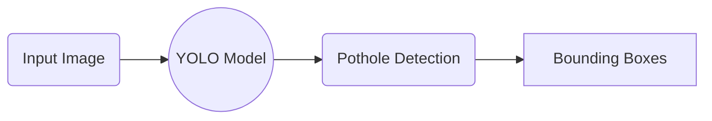

---

## 7. Why We Did Not Train the Model

The current implementation uses pretrained weights instead of training a new model from scratch. This was an intentional engineering decision.

### 7.1 Training Requires a Proper Dataset
Training a pothole detector requires a sufficiently large and representative dataset containing road images, annotations, different lighting conditions, camera angles, etc.

### 7.2 Existing Pretrained Model
A pothole-specific YOLOv8 model was already available. Instead of immediately spending time on dataset collection and hyperparameter tuning, we focused on building the complete production inference pipeline.

### 7.3 Current Project Objective
The current objective is to build an end-to-end system capable of:
`Image/Video` ➔ `API` ➔ `AI Inference` ➔ `Structured Detection` ➔ `Backend` ➔ `Report / Display`

### 7.4 Training Can Be Added Later
The architecture does not prevent future model training. A future version can replace `best.pt` with a newly trained model without changing the overall API contract.

---

## 8. AI Service Development Steps

| Step | Work Completed |
|------|----------------|
| 1 | Created dedicated Python environment |
| 2 | Installed AI dependencies |
| 3 | Downloaded and tested pretrained pothole model |
| 4 | Created professional project structure |
| 5 | Added configuration management |
| 6 | Created YOLO Model Manager |
| 7 | Created image inference layer |
| 8 | Created Pydantic response schemas |
| 9 | Created health endpoint |
| 10 | Created image detection endpoint |
| 11 | Tested image API |
| 12 | Created video processor |
| 13 | Created video detection endpoint |
| 14 | Tested video API |
| 15 | Added error handling |
| 16 | Added automated tests |
| 17 | Dockerized AI service |

---

## 9. Project Structure

```text
apps/
└── ai-service/
    ├── app/
    │   ├── core/
    │   │   ├── config.py
    │   │   ├── model.py
    │   │   ├── inference.py
    │   │   └── video_processor.py
    │   ├── api/
    │   │   └── routes/
    │   │       ├── health.py
    │   │       └── detection.py
    │   ├── schemas/
    │   │   └── detection.py
    │   └── main.py
    ├── tests/
    │   ├── __init__.py
    │   ├── test_health.py
    │   ├── test_image_detection.py
    │   └── test_video_detection.py
    ├── best.pt
    ├── requirements.txt
    ├── .env
    ├── .env.example
    ├── Dockerfile
    └── .dockerignore
```

---

## 10. Configuration

Configuration is separated from application code using `.env` and `.env.example`, and loaded through **Pydantic Settings**. 

> [!IMPORTANT]
> The `.env` file is intentionally excluded from the Docker image. Runtime secrets/configuration should be supplied through environment variables.

---

## 11. YOLO Model Manager

The model is expensive to load. Instead of loading it per request, the service uses a `YOLOModelManager`.

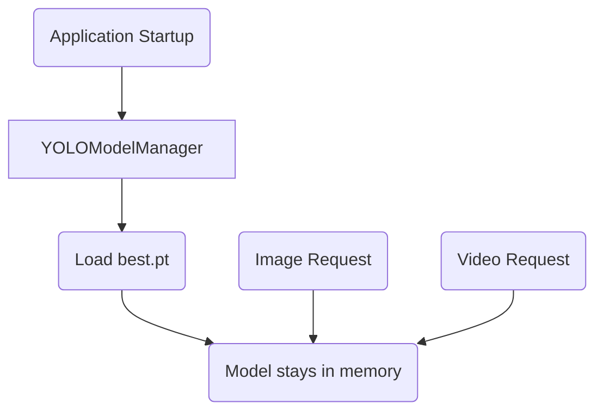

**Benefits:**
- Avoids loading weights for every request
- Reduces startup overhead per request
- Centralizes model management
- Makes future model replacement easier

---

## 12. Image Inference Pipeline

The inference layer (`app/core/inference.py`) receives an image and uses the existing model manager. It does **not** deal with HTTP requests.

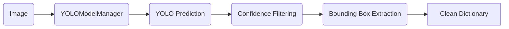

---

## 13. Image API

Endpoint: `POST /detect/image`

The client uploads an image using multipart form data.
```bash
curl -X POST \
  -F "image=@test_potholes.jpeg" \
  http://127.0.0.1:8000/detect/image
```

---

## 14. Video Processing Pipeline

Video detection is implemented separately using **OpenCV**. The important architectural decision is that the video processor **reuses the existing image inference function** (`detect_image()`).

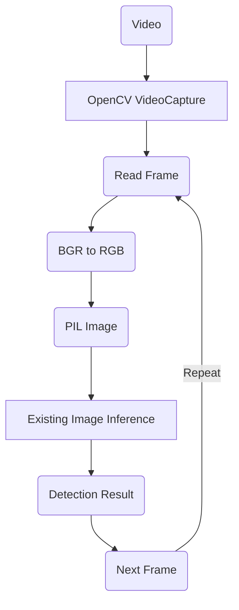

---

## 15. Video API

Endpoint: `POST /detect/video`

```bash
curl -X POST \
  -F "video=@testing.mp4" \
  http://127.0.0.1:8000/detect/video
```

The uploaded video is first written to a temporary file, processed frame-by-frame, and then removed after processing using a `finally` cleanup block to prevent storage leaks.

---

## 16. Response Handling

The raw YOLO response is not directly exposed. Instead, it is converted into a structured **Pydantic Schema** (`app/schemas/detection.py`).

```json
{
  "detected": true,
  "count": 3,
  "detections": [
    {
      "class_id": 0,
      "confidence": 0.564,
      "bbox": {
        "x1": 100,
        "y1": 120,
        "x2": 350,
        "y2": 300
      }
    }
  ]
}
```

---

## 17. Error Handling

The AI service handles invalid input gracefully.

- **Invalid Image:** `400 Bad Request`
- **Invalid Video:** `400 Bad Request`
- **Unexpected Server Error:** `500 Internal Server Error`

> [!NOTE]
> HTTP exceptions are re-raised before generic exception handling to prevent intentionally generated HTTP errors from being incorrectly converted into generic 500 responses.

---

## 18. API Endpoints

| Method | Endpoint | Purpose |
|--------|----------|---------|
| **GET** | `/health` | Check whether AI service is running |
| **POST** | `/detect/image` | Detect potholes in an image |
| **POST** | `/detect/video` | Detect potholes frame-by-frame in a video |

---

## 19. Testing

Automated tests are implemented using `pytest` and `httpx`.

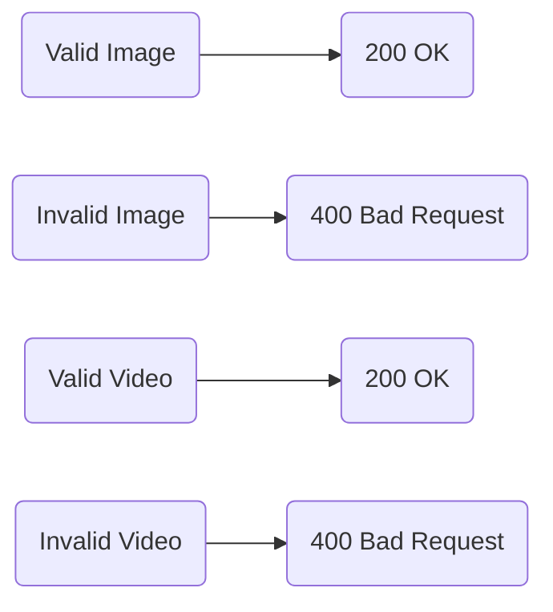

The tests verify both successful requests and error responses, asserting the expected Pydantic detection response structure.

---

## 20. Dockerization

The AI service is containerized in `pothole-ai-service`.

**Dockerfile Highlights:**
- `FROM python:3.11-slim`
- Installs OpenCV system dependencies (`libgl1`, `libglib2.0-0`)
- Installs `requirements.txt`
- Exposes port `8000`

---

## 21. Complete Request Flow

### Image Request
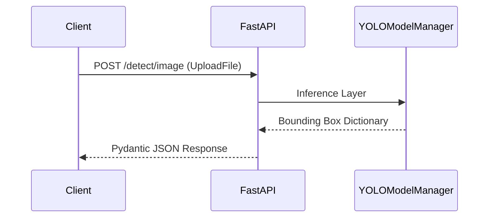

### Video Request
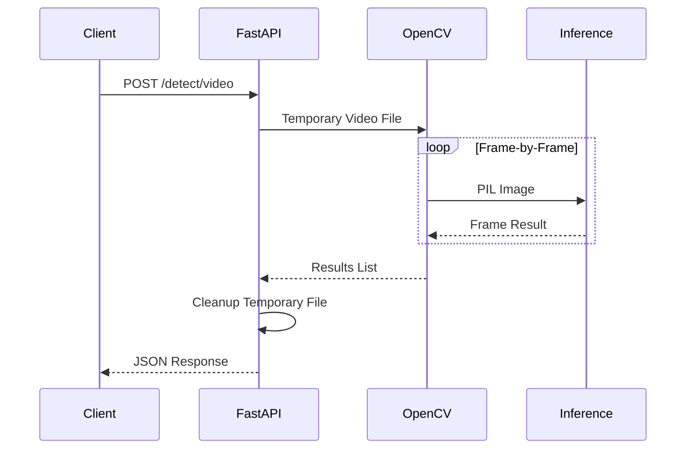

---

## 22. Important Design Decisions

1. **Separate AI Service**: Scaled independently of the Node backend.
2. **Model Loaded Once**: Server Start ➔ Load Model ➔ Keep Model in Memory.
3. **Reuse Image Inference for Video**: Prevents duplicate logic.
4. **Pydantic Response Contract**: Creates a predictable contract for the backend.
5. **Temporary Video Cleanup**: Always cleaned up in `finally` blocks.
6. **Environment Separation**: Prevents Python dependencies from polluting the main backend.

---

## 23. Current Limitations

1. **No custom model training**: Currently using pretrained weights.
2. **Frame-by-frame video**: Computationally expensive for high-FPS videos.
3. **No GPU optimization**: Current Docker config is CPU-oriented.
4. **No persistent storage**: AI service returns results; DB storage belongs to backend.
5. **No authentication**: Backend-to-AI security can be added later.
6. **Synchronous video**: Large videos could benefit from background job queues.

---

## 24. Future Improvements

- **Model Improvements**: Train and fine-tune YOLO on a custom dataset.
- **Video Optimization**: Process selected frames (e.g., Frame 1 ➔ Frame 5 ➔ Frame 10) instead of every frame.
- **Async Processing**: Introduce Redis + Celery/BullMQ for long video jobs.
- **GPU Inference**: Introduce CUDA for faster YOLO throughput.
- **Model Versioning**: Keep track of `pothole-v1.pt`, `v2.pt`.

---

## 25. Running Locally

```bash
cd apps/ai-service
source .venv/bin/activate
pip install -r requirements.txt
uvicorn app.main:app --reload
```
The service will run at: `http://127.0.0.1:8000`

---

## 26. Running with Docker

```bash
docker build -t pothole-ai-service .
docker run -d --rm -p 8000:8000 --name pothole-api pothole-ai-service
```
Check logs:
```bash
docker logs pothole-api
```
Stop the container:
```bash
docker stop pothole-api
```

---

## 27. Integration with Main Backend

The final system will follow:
`Frontend` ➔ `Main Backend` ➔ `AI Microservice` ➔ `YOLOv8`

**Future Docker Compose Architecture:**
Inside Docker Compose, the backend can communicate with the AI service using its service name rather than localhost (e.g., `http://ai-service:8000`).

### Final Architecture Summary
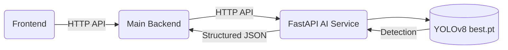

The AI service is now independently runnable, testable, error-handled, and Dockerized, keeping a stable API contract for future backend integration.
