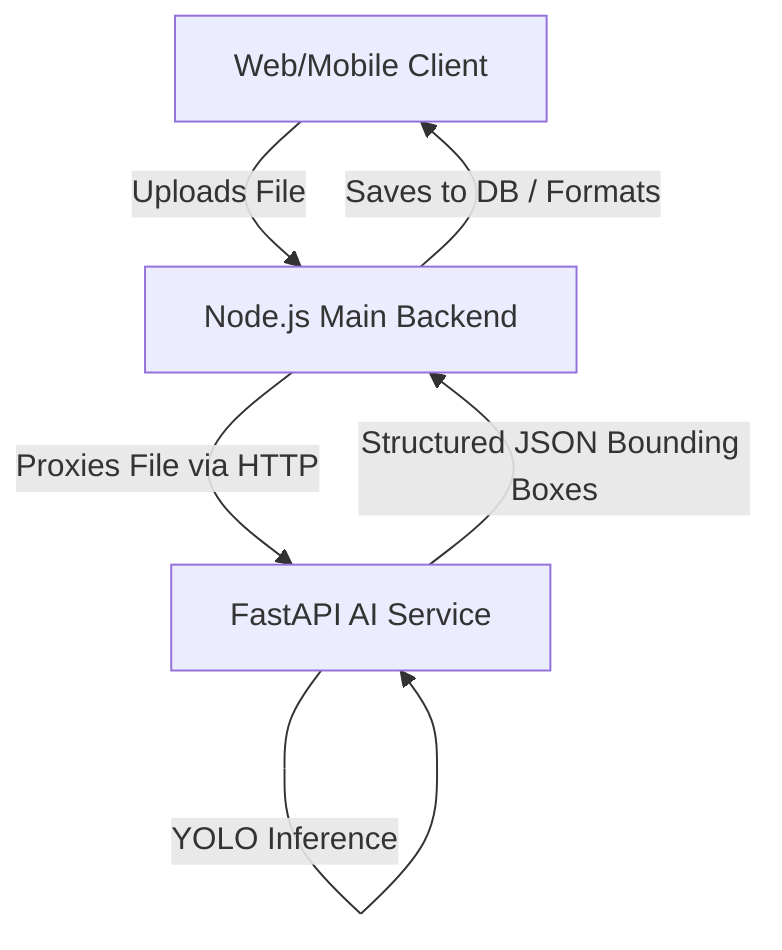
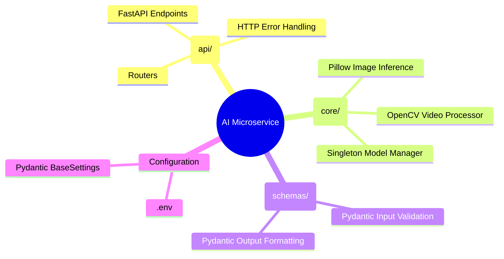
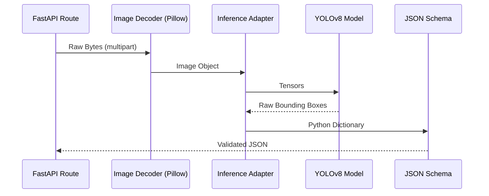

# 🧠 AI Service Architecture

> [!NOTE]
> This document details the architectural choices, data flow, and separation of concerns for the Smart Pothole Detection AI Microservice.

---

## 1. Core Architectural Pattern

The AI service is designed as an **Independent Inference Microservice**. 

It does not interact with a database, it does not hold state between requests, and it does not authenticate users. It serves a singular purpose: **Stateless Computer Vision Inference**.



### Why this pattern?
1. **Scalability:** AI inference is highly CPU/GPU bound. By isolating it, we can scale the AI service instances up or down independently of the main Node.js web server.
2. **Dependency Isolation:** Node.js handles the web/API layer effortlessly, while Python (with OpenCV and PyTorch/Ultralytics) dominates the ML ecosystem. Mixing these in one monolith is dangerous.

---

## 2. Internal Service Architecture

Inside the AI microservice, we follow a strict **Domain-Driven Design (DDD)** folder structure.



### 2.1 The Singleton Model Manager
Loading a YOLO model (`best.pt`) from disk to memory takes time. Doing this on every HTTP request would completely bottleneck the server. 
**Solution:** A Singleton `YOLOModelManager` loads the model exactly once when Uvicorn boots. Every subsequent request references this pre-loaded memory space.

### 2.2 The Video Processing Loop
Video processing does not use a separate model. To guarantee consistency:
1. Video is saved to a `tmp` file.
2. OpenCV extracts frames.
3. Every frame is passed through the *exact same* image inference function (`detect_image()`).
4. The temp file is safely deleted in a `finally` block to prevent disk bloat.

### 2.3 Detailed Directory Architecture

To ensure the microservice remains maintainable, the files are strictly segregated by their domain of responsibility.

```text
apps/ai-service/
│
├── app/                        # Main Application Code
│   ├── api/                    # API Routing Layer
│   │   └── routes/             
│   │       ├── detection.py    # The POST /detect endpoints for image and video
│   │       └── health.py       # The GET /health endpoint for liveness probes
│   │
│   ├── core/                   # Core Business Logic & AI
│   │   ├── config.py           # Loads .env variables into Pydantic Settings
│   │   ├── inference.py        # Translates YOLO tensors into Python bounding boxes
│   │   ├── model.py            # Singleton pattern for loading the YOLOv8 model
│   │   └── video_processor.py  # OpenCV frame extraction and temp file handling
│   │
│   ├── schemas/                # Data Contracts
│   │   └── detection.py        # Pydantic models (BoundingBox, DetectionResponse)
│   │
│   └── main.py                 # FastAPI Application Factory (App entry point)
│
├── tests/                      # Pytest Automated Testing Suite
│   ├── __init__.py
│   ├── test_health.py          # Verifies liveness probe
│   ├── test_image_detection.py # Verifies image inference and 400 Bad Request
│   └── test_video_detection.py # Verifies video inference and temp file cleanup
│
├── .env.example                # Template for environment variables
├── .dockerignore               # Prevents .venv and tests from entering production container
├── Dockerfile                  # Instructions for building the python:3.11-slim container
├── best.pt                     # The specialized Pothole YOLOv8 model weights
├── requirements.txt            # Python dependencies (fastapi, ultralytics, opencv, etc.)
└── README.md                   # AI Service local documentation
```

#### Directory Roles:
- **`app/api/`**: **No AI logic lives here.** This folder strictly handles HTTP concepts (Status codes, Headers, File Upload parsing).
- **`app/core/`**: **No HTTP logic lives here.** This folder handles the heavy lifting (Tensors, Matrices, OpenCV Video capture). If we moved from FastAPI to a gRPC server tomorrow, the `core/` folder would remain completely unchanged.
- **`app/schemas/`**: Forms the bridge between `core` and `api`. Validates that the AI service always outputs data in the shape the Main Backend expects.

---

## 3. Data Flow

### Image Processing Flow



---

## 4. Technology Choices

| Layer | Technology | Why we chose it |
|-------|------------|-----------------|
| **Web Server** | FastAPI / Uvicorn | Extremely fast, native async/await, auto-generates OpenAPI docs. |
| **Object Detection** | YOLOv8 (Ultralytics) | State-of-the-art real-time detection, excellent python bindings. |
| **Video Handling** | OpenCV (cv2) | Industry standard for efficient frame-by-frame extraction without loading entire MP4s into memory. |
| **Validation** | Pydantic | Enforces strict API contracts. If the AI changes output shapes, it fails locally before crashing the main backend. |
| **Deployment** | Docker | Bundles complex C++ requirements (`libgl1`) with Python, guaranteeing consistent environments across machines. |

---

## 5. Security & Error Handling

To ensure the AI service cannot crash the overarching platform:
1. **Never Trust Input:** File headers are validated. Corrupt images or empty videos trigger a graceful `400 Bad Request` instead of throwing a Python `ValueError` or `cv2.error`.
2. **No Raw Stack Traces:** Generic exceptions are caught and masked behind a `500 Internal Server Error`.
3. **No Stateful Storage:** Uploaded files exist purely in volatile memory (Images) or temporary self-deleting disk space (Videos). No user data persists on the AI server.
