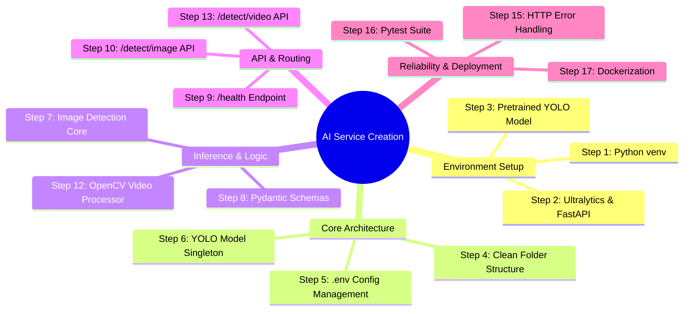
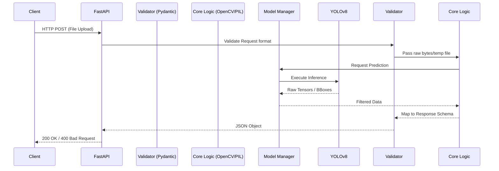
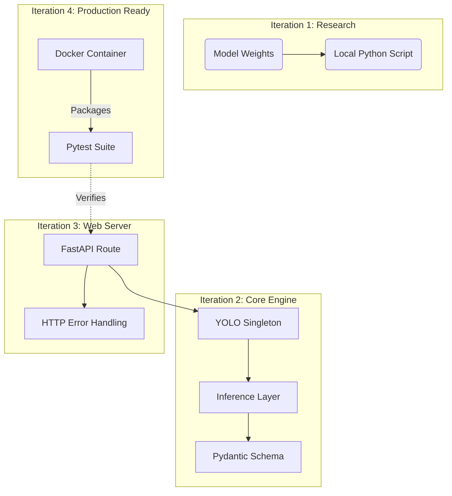

# 🚀 AI Service Development Guide (The 17-Step Roadmap)

> [!NOTE]
> This guide serves as a **historical blueprint and development playbook**. It explains exactly **how** and **why** the AI Microservice for the Smart Pothole Detection system was built across 17 incremental steps. Use this guide if you need to replicate this service, build a new AI microservice, or understand the architectural evolution of this project.

---

## 🗺️ The Development Mindmap

---

## 🏗️ Architectural Flow of the Completed Service

Before diving into the steps, here is the architecture that these 17 steps achieved:

---

## 📚 The 17 Steps to Production

### Phase 1: Environment & Model Verification

> [!TIP]
> **Objective:** Prove that the model works before writing a single line of API code. Never build an API around a broken model.

#### Step 1: Create Dedicated Python Environment
- **How:** Created a `.venv` directory inside `apps/ai-service`.
- **Why:** AI dependencies (PyTorch, OpenCV) are massive and conflict easily. By isolating the environment, we prevented polluting the Node.js/global environment and kept the microservice fully decoupled.

#### Step 2: Install AI Dependencies
- **How:** Installed `ultralytics`, `fastapi`, `uvicorn`, `opencv-python`, `pillow`, `pydantic-settings`, and `python-dotenv`.
- **Why:** Ultralytics provides the YOLO framework. FastAPI provides the fastest async web framework for Python. OpenCV is required for reading video frames.

#### Step 3: Download and Test Pretrained Model
- **How:** Downloaded `Samdutse/pothole-yolov8` (`best.pt`) and wrote a temporary `test_model.py` script.
- **Why:** We needed a specialized model, not a generic COCO model. Testing it on `test_potholes.jpeg` locally proved that the weights were valid and could detect potholes accurately.

---

### Phase 2: Core Engineering & Architecture

> [!IMPORTANT]
> **Objective:** Design a production-grade folder structure and memory-safe model loader.

#### Step 4: Professional Project Structure
- **How:** Segregated logic into `app/api`, `app/core`, `app/schemas`, and `app/main.py`.
- **Why:** Avoids spaghetti code. It enforces separation of concerns: Routers don't do inference, inference doesn't do HTTP validation.

#### Step 5: Configuration Management
- **How:** Used `pydantic-settings` to load `.env` variables (like `IMAGE_SIZE=640`).
- **Why:** Hardcoding values inside functions is a bad practice. Environment variables allow the service to behave differently in Dev, Staging, and Production without code changes.

#### Step 6: Create YOLO Model Manager
- **How:** Built a Singleton class (`YOLOModelManager`) that loads the model into memory exactly once at startup.
- **Why:** Loading a neural network takes time and RAM. If we loaded the model inside the API route, *every* user request would take 5 seconds just to load the model. The Singleton pattern makes inference instant.

---

### Phase 3: Inference & Data Contracts

#### Step 7: Image Inference Layer
- **How:** Created `detect_image(image)` which converts raw YOLO tensor outputs into a clean Python dictionary of bounding boxes and confidences.
- **Why:** APIs shouldn't return proprietary Ultralytics objects. This layer acts as an adapter, filtering out low-confidence predictions.

#### Step 8: Pydantic Response Schemas
- **How:** Created `DetectionResponse` and `BoundingBox` models in `schemas/detection.py`.
- **Why:** Acts as a strict contract between the AI service and the Main Backend. If the AI service accidentally changes its output shape, Pydantic catches it immediately, preventing downstream backend crashes.

---

### Phase 4: API Exposure (Images)

#### Step 9: Create `/health` Endpoint
- **How:** Added a simple `GET /health` returning `{"status": "ok"}`.
- **Why:** Crucial for Docker health checks and Kubernetes liveness probes. If the service hangs, the orchestrator needs to know.

#### Step 10: Create `/detect/image` Endpoint
- **How:** Created a `POST` route accepting `UploadFile`, decoding the bytes into a `PIL.Image`, and passing it to Step 7's inference layer.
- **Why:** This is the actual bridge allowing external applications (like the Node backend) to send images via HTTP.

#### Step 11: Test Image API
- **How:** Used `curl` to simulate a Postman file upload request against the running FastAPI server.
- **Why:** Verified the HTTP layer correctly serialized the Pydantic schema into JSON.

---

### Phase 5: Video Capabilities

> [!WARNING]
> **Challenge:** Videos cannot be passed directly to YOLO. They are just a fast sequence of images.

#### Step 12: Create Video Processor
- **How:** Used `cv2.VideoCapture` to extract frames, convert them from BGR to RGB, and pass them *one-by-one* to the existing `detect_image` function from Step 7.
- **Why:** We reused the exact same inference logic. This guarantees that an image and a video frame will always be evaluated exactly the same way.

#### Step 13: Create `/detect/video` Endpoint
- **How:** Created a `POST` route that saves the uploaded video to a `tempfile`, passes the file path to Step 12, and ensures `os.remove()` runs in a `finally` block.
- **Why:** OpenCV requires a physical file path on disk; it cannot easily read from an HTTP byte stream. The `finally` block prevents server disk space from filling up with old videos.

#### Step 14: Test Video API
- **How:** Triggered a `curl` request using `testing.mp4`.
- **Why:** Verified that the chunked file-writing mechanism didn't corrupt the video and that memory usage remained stable during frame extraction.

---

### Phase 6: Hardening & Deployment

#### Step 15: Error Handling
- **How:** Wrapped routes in `try/except` blocks. Caught `UnidentifiedImageError` and `ValueError` (for `cap.isOpened() == False`) to return `400 Bad Request`. Generic errors return `500`.
- **Why:** An API should never crash or spit out a raw Python stack trace to the client. Controlled HTTP error codes allow the Main Backend to display user-friendly errors ("Please upload a valid video").

#### Step 16: Automated Tests (Pytest)
- **How:** Created `tests/` directory with tests utilizing FastAPI's `TestClient` to test all endpoints with both valid and corrupted files.
- **Why:** CI/CD integration. In the future, if someone updates a dependency or modifies the model manager, `pytest` will instantly verify if the API contracts were broken.

#### Step 17: Dockerization
- **How:** Wrote a `Dockerfile` using `python:3.11-slim`, specifically adding `apt-get install libgl1 libglib2.0-0` (OpenCV system requirements), and an optimized `.dockerignore`.
- **Why:** "It works on my machine" is not an acceptable deployment strategy. Docker guarantees that the exact same OS dependencies, python version, and model weights are packaged together and will run flawlessly on any server.

---

## 🎨 Summary of Architectural Evolution

By following these 17 structured steps, we prevented monolithic spaghetti code and successfully built a robust, scalable, and independent AI microservice!
