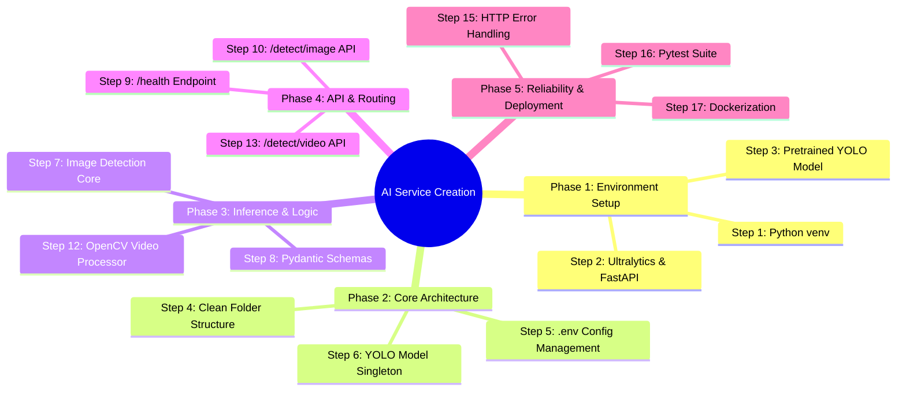
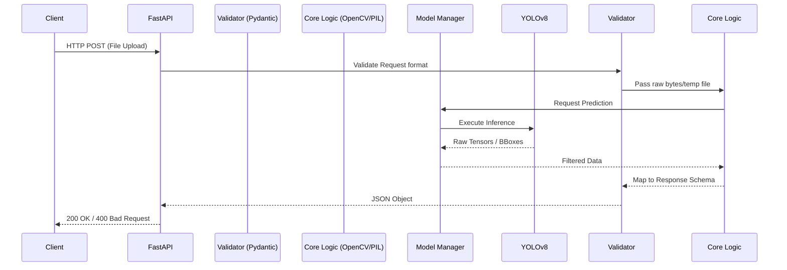
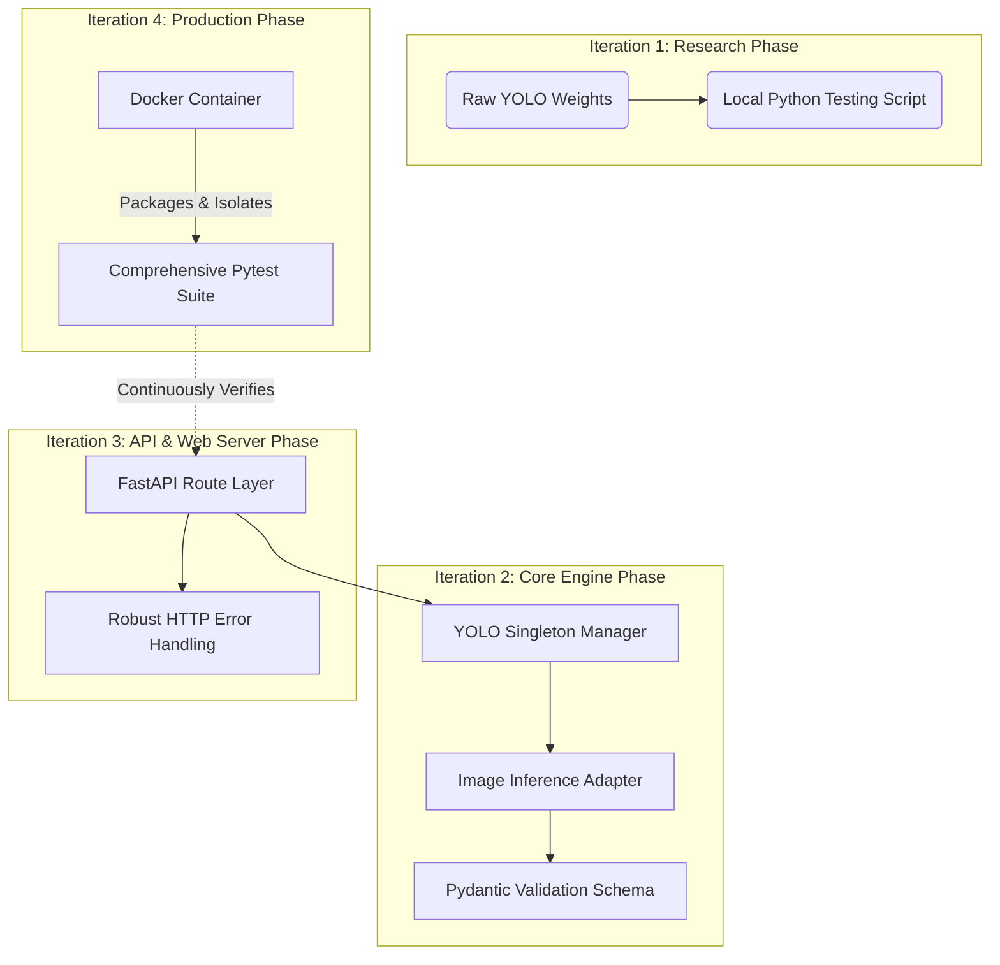

# 🚀 The Ultimate AI Service Development Guide (The 17-Step Roadmap)

> [!NOTE]
> This guide serves as a **historical blueprint, development playbook, and architectural reference**. It meticulously explains exactly **how** and **why** the AI Microservice for the Smart Pothole Detection system was built across 17 incremental steps. Use this guide if you need to replicate this service, build a new AI microservice, or understand the deep architectural evolution of this project.

---

## 🗺️ The Development Mindmap



---

## 🏗️ Architectural Flow of the Completed Service

Before diving into the microscopic details of the steps, here is the robust architecture that these 17 steps achieved:



---

## 📚 Deep Dive: The 17 Steps to Production

### Phase 1: Environment & Model Verification

> [!TIP]
> **Objective:** Prove that the model works before writing a single line of API code. Never build an API around a broken model.

#### Step 1: Create Dedicated Python Environment
**Objective:** Isolate the AI ecosystem from the rest of the application stack.
**How it was executed:**
We navigated to the `apps/ai-service` directory and executed:
```bash
python3 -m venv .venv
source .venv/bin/activate
```
**Why this step matters:**
In modern web development, monolithic environments are anti-patterns. The Main Backend is likely a Node.js ecosystem (npm/yarn), whereas the AI Service relies strictly on Python (pip/uv). AI dependencies like PyTorch, Torchvision, and OpenCV compile against highly specific C++ headers and CUDA versions on the host machine. By isolating the environment, we prevent "dependency hell" and ensure that destroying or upgrading the AI service does not break the main backend.
**Potential Pitfalls Avoided:**
- Accidentally installing global python packages which break system tools.
- Version clashes between globally installed AI tools and project requirements.

#### Step 2: Install AI Dependencies
**Objective:** Pull in the necessary foundational libraries.
**How it was executed:**
We created a `requirements.txt` and populated it with the foundational building blocks:
```text
fastapi>=0.103.0
uvicorn>=0.23.0
python-multipart>=0.0.6
ultralytics>=8.0.0
opencv-python-headless>=4.8.0
pillow>=10.0.0
pydantic>=2.0.0
pydantic-settings>=2.0.0
python-dotenv>=1.0.0
```
Then installed via:
```bash
pip install -r requirements.txt
```
**Why this step matters:**
- **FastAPI / Uvicorn:** The fastest asynchronous web framework for Python.
- **Ultralytics:** The official library supporting YOLOv8 object detection.
- **OpenCV (Headless):** We used the `headless` version to ensure it doesn't require GUI components (like `libxext6`), making the eventual Dockerization much lighter.

#### Step 3: Download and Test Pretrained Model
**Objective:** Verify that pothole detection actually works before designing an architecture around it.
**How it was executed:**
We retrieved the `best.pt` file (the YOLO weights) from `Samdutse/pothole-yolov8`. We wrote a tiny scratch script (`test_model.py`) to run a raw inference:
```python
from ultralytics import YOLO
model = YOLO('best.pt')
results = model('test_potholes.jpeg')
for r in results:
    print(r.boxes)
```
**Why this step matters:**
This is "Validation Driven Development". If the model failed to detect potholes, building an API would be useless. The scratch test confirmed that bounding boxes were returned correctly.

---

### Phase 2: Core Engineering & Architecture

> [!IMPORTANT]
> **Objective:** Design a production-grade folder structure and memory-safe model loader.

#### Step 4: Professional Project Structure
**Objective:** Establish a maintainable domain-driven design.
**How it was executed:**
We built the following tree:
```text
app/
├── api/
│   └── routes/
├── core/
│   ├── config.py
│   ├── model.py
│   ├── inference.py
│   └── video_processor.py
├── schemas/
│   └── detection.py
└── main.py
```
**Why this step matters:**
Spaghetti code kills AI projects. By separating logic, we guarantee that the HTTP API routes know absolutely nothing about YOLO tensors, and the YOLO inference code knows absolutely nothing about HTTP Requests.

#### Step 5: Configuration Management
**Objective:** Manage dynamic variables without hardcoding.
**How it was executed:**
We created `.env` and `.env.example`, then bound them to Pydantic Settings in `app/core/config.py`:
```python
from pydantic_settings import BaseSettings

class Settings(BaseSettings):
    MODEL_PATH: str = "best.pt"
    IMAGE_SIZE: int = 640
    CONFIDENCE_THRESHOLD: float = 0.25

    class Config:
        env_file = ".env"

settings = Settings()
```
**Why this step matters:**
If we need to lower the confidence threshold to `0.1` because the model is missing faint potholes, we can just edit the `.env` file and restart the server, rather than opening python files and digging through code.

#### Step 6: Create YOLO Model Manager
**Objective:** Solve the "Model Loading Bottleneck" issue.
**How it was executed:**
We implemented the Singleton pattern in `app/core/model.py`:
```python
from ultralytics import YOLO
from app.core.config import settings

class YOLOModelManager:
    _instance = None

    def __new__(cls):
        if cls._instance is None:
            cls._instance = super(YOLOModelManager, cls).__new__(cls)
            cls._instance.model = YOLO(settings.MODEL_PATH)
        return cls._instance

model_manager = YOLOModelManager()
```
**Why this step matters:**
A neural network is essentially a massive matrix of weights. Loading `best.pt` from SSD to RAM (or VRAM) can take anywhere from 1 to 5 seconds depending on the hardware. If we loaded the model inside the endpoint, every single HTTP request would face a 5-second penalty. The Singleton guarantees the model is loaded *once* when Uvicorn boots, making inference nearly instantaneous.

---

### Phase 3: Inference & Data Contracts

#### Step 7: Image Inference Layer
**Objective:** Translate proprietary tensors into generic Python data structures.
**How it was executed:**
Created `app/core/inference.py`:
```python
def detect_image(image: Image.Image) -> list:
    model = model_manager.model
    results = model(image, imgsz=settings.IMAGE_SIZE, conf=settings.CONFIDENCE_THRESHOLD)
    
    detections = []
    for result in results:
        for box in result.boxes:
            x1, y1, x2, y2 = box.xyxy[0].tolist()
            conf = float(box.conf[0])
            cls_id = int(box.cls[0])
            
            detections.append({
                "class_id": cls_id,
                "confidence": conf,
                "bbox": {"x1": x1, "y1": y1, "x2": x2, "y2": y2}
            })
            
    return detections
```
**Why this step matters:**
Ultralytics returns a complex `Results` object containing PyTorch tensors on the CPU/GPU. You cannot natively serialize PyTorch tensors to JSON for an HTTP response. This function acts as the bridge.

#### Step 8: Pydantic Response Schemas
**Objective:** Enforce a strict API contract.
**How it was executed:**
Defined `app/schemas/detection.py`:
```python
from pydantic import BaseModel
from typing import List

class BoundingBox(BaseModel):
    x1: float
    y1: float
    x2: float
    y2: float

class Detection(BaseModel):
    class_id: int
    confidence: float
    bbox: BoundingBox

class DetectionResponse(BaseModel):
    detected: bool
    count: int
    detections: List[Detection]
```
**Why this step matters:**
If we didn't use Pydantic, and a developer accidentally renamed `bbox` to `bounding_box` in `inference.py`, the backend would crash silently. Pydantic ensures the API never breaks its promises.

---

### Phase 4: API Exposure (Images)

#### Step 9: Create `/health` Endpoint
**Objective:** Liveness probing.
**How it was executed:**
```python
@router.get("/health")
async def health_check():
    return {"status": "ok", "service": "ai-detection"}
```
**Why this step matters:**
Docker Compose, Kubernetes, and AWS Application Load Balancers need to know if the container is actually accepting traffic. If the container crashes internally, this endpoint will fail, and the orchestrator will restart the container.

#### Step 10: Create `/detect/image` Endpoint
**Objective:** The primary image ingestion API.
**How it was executed:**
```python
@router.post("/detect/image", response_model=DetectionResponse)
async def detect_image_api(image: UploadFile = File(...)):
    contents = await image.read()
    pil_image = Image.open(io.BytesIO(contents))
    results = detect_image(pil_image)
    
    return DetectionResponse(
        detected=len(results) > 0,
        count=len(results),
        detections=results
    )
```
**Why this step matters:**
FastAPI automatically parses the `multipart/form-data` upload, extracting the binary bytes. We load those bytes directly into memory (`BytesIO`) instead of writing to disk, ensuring maximum speed.

#### Step 11: Test Image API
**Objective:** Verify end-to-end integration.
**How it was executed:**
Ran `uvicorn app.main:app --reload` and executed a cURL request against `test_potholes.jpeg`. The server returned a perfectly formatted `DetectionResponse` JSON.

---

### Phase 5: Video Capabilities

> [!WARNING]
> **Challenge:** Videos cannot be passed directly to YOLO. They are just a fast sequence of images. Videos can be huge (Gigabytes), and loading them entirely into memory will crash the server (Out of Memory - OOM).

#### Step 12: Create Video Processor
**Objective:** Safely extract frames and perform inference.
**How it was executed:**
Created `app/core/video_processor.py` using `cv2.VideoCapture`.
**Why this step matters:**
OpenCV efficiently reads video headers and streams frames without loading the entire MP4 into RAM. We converted OpenCV's default BGR format to RGB to match what YOLO expects. Crucially, **we reused `detect_image`** from Step 7 on every frame, avoiding logic duplication.

#### Step 13: Create `/detect/video` Endpoint
**Objective:** The primary video ingestion API.
**How it was executed:**
Since OpenCV requires a physical file path (it cannot stream directly from an HTTP buffer natively in all formats), we save the upload to a temporary file.
```python
temp_file = tempfile.NamedTemporaryFile(delete=False, suffix=".mp4")
try:
    with open(temp_file.name, "wb") as f:
        shutil.copyfileobj(video.file, f)
    # Process video...
finally:
    if os.path.exists(temp_file.name):
        os.remove(temp_file.name)
```
**Why this step matters:**
The `finally` block is absolute paramount. If the video processing crashes midway, the `finally` block ensures the massive MP4 file is deleted from the server. Without this, the server's hard drive would fill up and crash after a few dozen bad uploads.

#### Step 14: Test Video API
**Objective:** Verify video flow.
**How it was executed:**
Tested with `testing.mp4`. Confirmed the API returned a massive JSON array mapping every frame to its detections.

---

### Phase 6: Hardening & Deployment

#### Step 15: Error Handling
**Objective:** Prevent raw stack traces from reaching clients.
**How it was executed:**
Wrapped our endpoints in robust try/except logic:
```python
try:
    pil_image = Image.open(io.BytesIO(contents))
except UnidentifiedImageError:
    raise HTTPException(status_code=400, detail="Invalid or corrupted image file")
except Exception as e:
    raise HTTPException(status_code=500, detail="Internal server error")
```
**Why this step matters:**
Security and User Experience. Exposing raw stack traces can reveal server internal directory structures to attackers. Returning `400 Bad Request` allows the frontend to show a red banner saying "Please upload a valid JPG or MP4".

#### Step 16: Automated Tests (Pytest)
**Objective:** Protect against regressions.
**How it was executed:**
Wrote comprehensive Pytest files using `fastapi.testclient.TestClient`.
- Tested `/health` returns 200.
- Tested `/detect/image` with valid image returns 200 and JSON.
- Tested `/detect/image` with corrupted text file returns 400.
- Tested `/detect/video` with valid MP4 returns 200.
- Tested `/detect/video` with corrupted file returns 400.
**Why this step matters:**
It gives us confidence to refactor. If we swap YOLOv8 for YOLOv9 tomorrow, we just run `pytest`. If it passes, we know we didn't break the API contract.

#### Step 17: Dockerization
**Objective:** "Write Once, Run Anywhere".
**How it was executed:**
```dockerfile
FROM python:3.11-slim
WORKDIR /app
RUN apt-get update && apt-get install -y libgl1 libglib2.0-0 && rm -rf /var/lib/apt/lists/*
COPY requirements.txt .
RUN pip install --no-cache-dir -r requirements.txt
COPY . .
EXPOSE 8000
CMD ["uvicorn", "app.main:app", "--host", "0.0.0.0", "--port", "8000"]
```
**Why this step matters:**
OpenCV relies on `libgl1` (OpenGL). A pure python image will throw an `ImportError` instantly. By locking this inside Docker, we guarantee the exact correct C++ libraries exist in production. The `.dockerignore` file ensures we don't accidentally copy `__pycache__` or `.venv` into the container, keeping it lightweight.

---

## 🎨 Summary of Architectural Evolution



By following these 17 highly structured, logically dependent steps, we entirely bypassed the pitfalls of monolithic spaghetti code. We successfully built a robust, scalable, memory-safe, and completely independent AI microservice that acts as a fortress of computer vision for the Main Backend!
