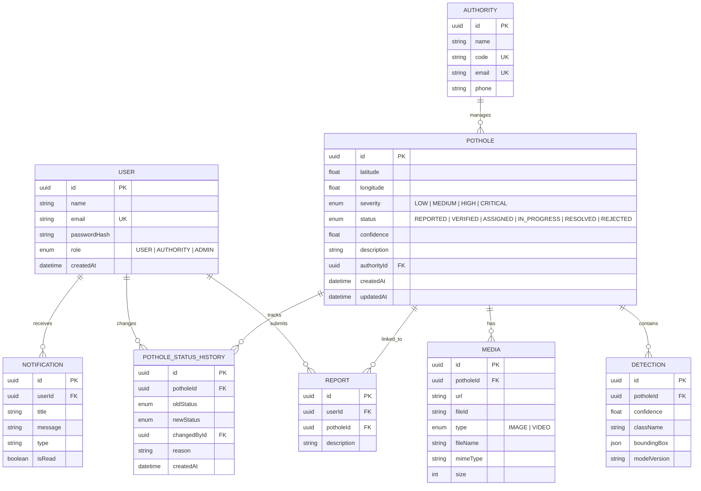
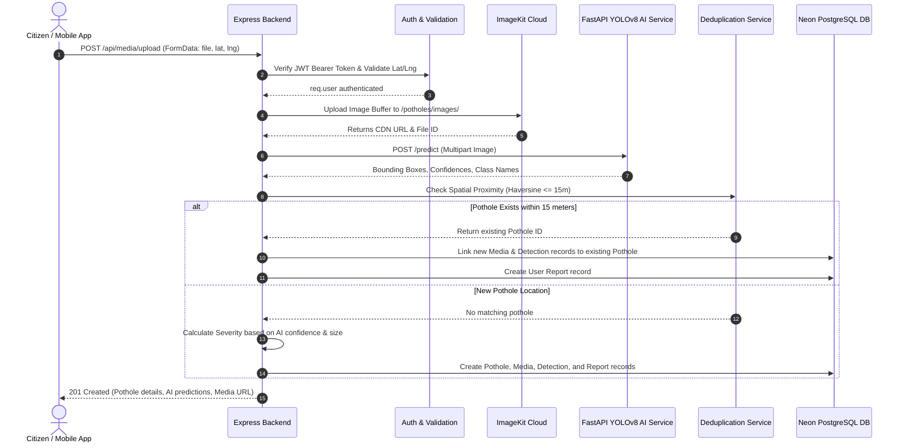
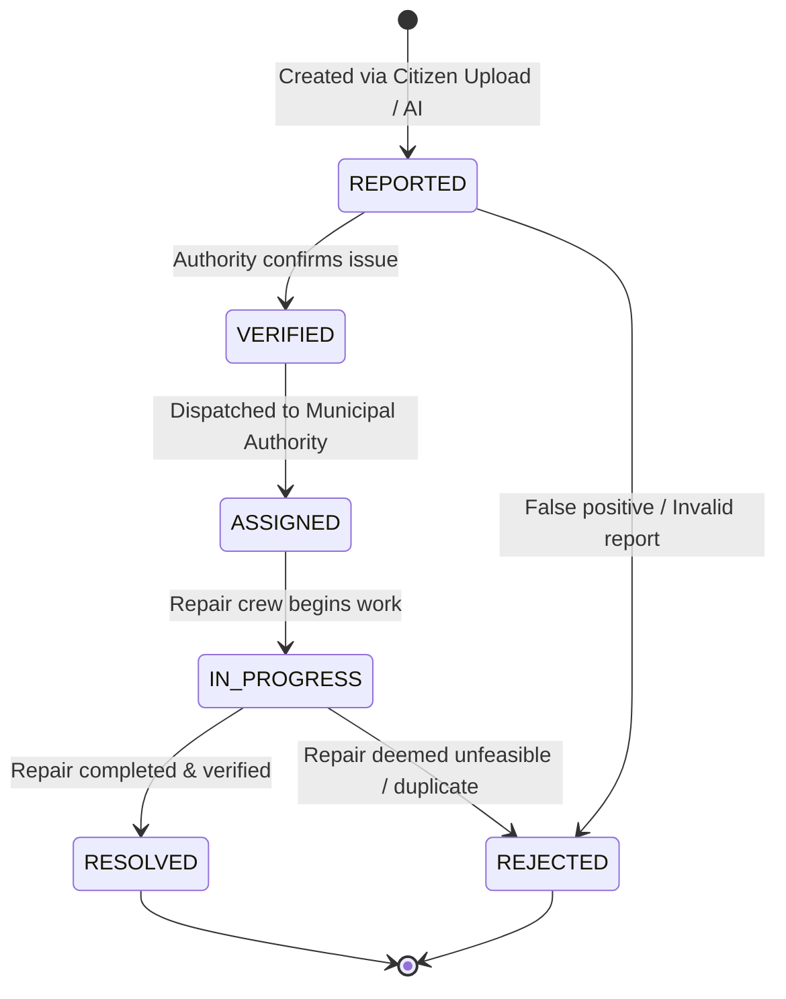

# Smart Pothole Detection & Reporting System — Backend Architecture & System Blueprint

## 1. System Overview

The **Smart Pothole Detection & Reporting System Backend** is built using **Node.js, Express.js, Prisma ORM, and Neon PostgreSQL**. It interfaces directly with a **FastAPI YOLOv8 AI Service** for real-time pothole detection and **ImageKit** for cloud image storage and CDN delivery.

### Tech Stack Overview

| Component | Technology | Description |
| :--- | :--- | :--- |
| **Runtime & Framework** | Node.js (v22) + Express.js (v4.21) | High-performance modular REST API server |
| **Database & ORM** | Neon Serverless PostgreSQL + Prisma ORM (v6.19) | Relational database with strict schemas and index optimizations |
| **Cloud Media Storage** | ImageKit SDK | Automated image optimization, transformation, and CDN delivery |
| **AI Computer Vision** | FastAPI + PyTorch / Ultralytics YOLOv8 | Microservice serving bounding-box & confidence predictions |
| **Authentication & RBAC** | JWT (JSON Web Tokens) + Argon2/Bcrypt | Access & refresh token rotation with `USER`, `AUTHORITY`, `ADMIN` roles |
| **Validation & Security** | Zod + Express Rate Limit + Helmet + CORS | Request payload validation, rate-limiting, and standard security headers |
| **Logging & Tracing** | Pino Logger | Structured JSON logging with per-request `x-request-id` correlation |
| **Testing Framework** | Jest (ESM) + Supertest | Automated API integration test suite (28/28 passing) |

---

## 2. Layered Architecture

The backend follows a clean **Controller-Service-Repository (Prisma)** layered pattern:

```text
                               ┌───────────────────────────┐
                               │       HTTP Client         │
                               └─────────────┬─────────────┘
                                             │
                                             ▼
                       ┌──────────────────────────────────────────┐
                       │           Security & Logging             │
                       │   Helmet | CORS | Pino Request Logger    │
                       └─────────────────────┬────────────────────┘
                                             │
                                             ▼
                       ┌──────────────────────────────────────────┐
                       │          Route-Specific Middleware       │
                       │   Rate Limiter | JWT Auth | RBAC Role    │
                       └─────────────────────┬────────────────────┘
                                             │
                                             ▼
                       ┌──────────────────────────────────────────┐
                       │            Validation Layer              │
                       │          Zod Schema Validation           │
                       └─────────────────────┬────────────────────┘
                                             │
                                             ▼
                       ┌──────────────────────────────────────────┐
                       │            Controller Layer              │
                       │    HTTP Request & Response Parsing       │
                       └─────────────────────┬────────────────────┘
                                             │
                                             ▼
                       ┌──────────────────────────────────────────┐
                       │              Service Layer               │
                       │   Business Logic & External Integrations │
                       │    (AI Service, ImageKit, Deduplication) │
                       └──────────────┬──────────────┬────────────┘
                                      │              │
                    ┌─────────────────┘              └──────────────────┐
                    ▼                                                   ▼
      ┌──────────────────────────┐                        ┌──────────────────────────┐
      │     External Services    │                        │    Prisma ORM & DB       │
      │ FastAPI YOLOv8 | ImageKit│                        │ Neon Serverless Postgres │
      └──────────────────────────┘                        └──────────────────────────┘
```

### Directory Structure & Responsibilities

```text
apps/backend/src/
├── app.js                   # Main Express application initialization & middleware stack
├── server.js                # HTTP server launcher & graceful shutdown hooks
├── config/
│   ├── env.js               # Environment variable validation & parsing
│   └── database.js          # Prisma Client singleton instantiation
├── constants/               # System enums & constants (Status, Severity, Roles)
├── middleware/
│   ├── auth.middleware.js   # JWT authentication & req.user attachment
│   ├── role.middleware.js   # Role-Based Access Control (RBAC) guard
│   ├── rateLimit.middleware.js # Configurable route-specific rate limiters
│   ├── validation.middleware.js # Zod body/query/params validation wrapper
│   ├── requestLogger.middleware.js # Pino logging with x-request-id tracking
│   ├── upload.middleware.js # Multer file upload handling (in-memory buffer)
│   ├── error.middleware.js  # Global centralized error handler
│   └── notFound.middleware.js # 404 handler for unknown routes
├── modules/
│   ├── auth/                # Register, Login, Token Refresh, Logout
│   ├── potholes/            # Pothole queries, filtering, status updates
│   ├── media/               # Media upload & AI inference orchestration
│   ├── dashboard/           # Analytics, map points, authority stats
│   ├── detections/          # YOLOv8 detection records
│   ├── authorities/         # Authority management
│   ├── notifications/       # User notification dispatcher
│   ├── reports/             # Citizen report submissions
│   └── users/               # User profile management
├── services/
│   ├── ai.service.js        # FastAPI YOLOv8 client wrapper
│   ├── storage.service.js   # ImageKit upload & deletion client
│   ├── deduplication.service.js # Spatial proximity matching (15m radius)
│   ├── severity.service.js  # Multi-factor severity calculation engine
│   ├── pothole.service.js   # Pothole domain operations
│   └── potholeStatus.service.js # State transition & audit history engine
└── utils/
    ├── AppError.js          # Custom operational error class
    ├── token.js             # JWT signing and verification helpers
    └── locationValidator.js # Latitude & longitude boundary validation
```

---

## 3. Database Entity-Relationship (ER) Schema



---

## 4. End-to-End Request Lifecycle & Execution Flows

### Flow 1: Media Upload, AI Processing & Pothole Deduplication (`POST /api/media/upload`)



### Flow 2: Status Management & Audit Lifecycle (`PATCH /api/potholes/:id/status`)



---

## 5. API Reference Summary

### Authentication Endpoints (`/api/auth`)

| Method | Endpoint | Access | Description |
| :--- | :--- | :--- | :--- |
| `POST` | `/register` | Public | Register new user account (`USER`, `AUTHORITY`, `ADMIN`) |
| `POST` | `/login` | Public | Authenticate credentials & return JWT access + refresh tokens |
| `POST` | `/refresh` | Public | Refresh expired access token using valid refresh token |
| `POST` | `/logout` | Protected | Invalidate refresh token and log out user |

### Pothole Management Endpoints (`/api/potholes`)

| Method | Endpoint | Access | Description |
| :--- | :--- | :--- | :--- |
| `GET` | `/` | Public | List potholes with filtering, sorting, search, and pagination |
| `GET` | `/:id` | Public | Fetch detailed pothole record with media, reports, and history |
| `PATCH`| `/:id/status` | `AUTHORITY` / `ADMIN` | Update pothole state with strict transition validation & audit log |

### Dashboard Analytics Endpoints (`/api/dashboard`)

| Method | Endpoint | Access | Description |
| :--- | :--- | :--- | :--- |
| `GET` | `/overview` | Protected | System summary stats (total, status breakdown, severity metrics) |
| `GET` | `/authorities`| Protected | Authority performance & assignment statistics |
| `GET` | `/map` | Public | Geo-spatial coordinates for mapping active potholes |
| `GET` | `/recent` | Public | Latest reported potholes for public feed |

---

## 6. Testing & Quality Assurance

The backend includes a comprehensive **Jest ESM** integration test suite (`apps/backend/tests/`):

- **`tests/utils/token.test.js`**: Token generation & verification logic.
- **`tests/middleware/middleware.test.js`**: Auth, RBAC, Zod validation, Rate Limiting, Pino logger.
- **`tests/auth/auth.test.js`**: Register, Login, Refresh Token rotation, Logout flows.
- **`tests/auth/rbac.test.js`**: Role authorization guards for `USER`, `AUTHORITY`, `ADMIN`.
- **`tests/potholes/potholes.test.js`**: Filtering, Pagination, Search, Sorting, and State transitions.
- **`tests/dashboard/dashboard.test.js`**: Statistics endpoints and geospatial map queries.
- **`tests/media/media.test.js`**: Upload pipeline integration tests.

### Test Execution Command
```bash
npm test
```
**Results**: 7 test suites, 28/28 tests passing with clean teardown.
